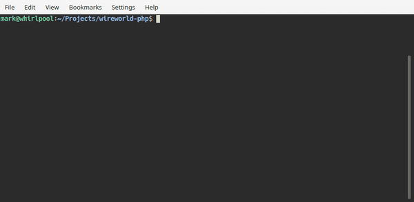

# Wireworld

[Wireworld](https://en.wikipedia.org/wiki/Wireworld) cellular automaton written
in PHP.



## Usage

```console
$ ./wireworld schemas/repeater.wire
```

## Rules

Wireworld rules are explained [here](https://xalava.github.io/WireWorld/). To
summarize:

A cell has one of four states. After every step, the cell updates its state
according to the following rules:

- Empty → Empty
- Electron head → Electron tail
- Electron tail → Connector
- Connector
    - Electron head if exactly one or two neighbouring cells are electron heads
    - Remains connector otherwise.

## Schema files

Schemas are simple text files representing the starting state of a Wireworld
automaton. It uses following characters:

- ` ` (space): empty cell
- `#`: connector
- `H`: electron head
- `t`: electron tail

For example, an AND gate:

```
H##########
           ###
        # #   #
H###   ###    #
    # # # # # #  #####
    # #    ###  #
    # #     # ##
     #
```

Take a look at [schemas](./schemas) for a list of predefined schemas.

## Basic mode

By default, [CLI Menu](https://github.com/php-school/cli-menu) is used to render
the simulation. Use `--mode=basic` for a, well, more basic version.

```console
$ ./wireworld schemas/diodes.wire --mode=basic
Starting simulation..

      ░░     
█░░░░░░ ░░░░░
      ░░     
             
      ░░     
█░░░░░ ░░░░░░
      ░░     

[S]tep / [r]estart / [q]uit: 

      ░░     
▒█░░░░░ ░░░░░
      ░░     
             
      ░░     
▒█░░░░ ░░░░░░
      ░░     

[S]tep / [r]estart / [q]uit: 

      ░░     
░▒█░░░░ ░░░░░
      ░░     
             
      ░░     
░▒█░░░ ░░░░░░
      ░░     

[S]tep / [r]estart / [q]uit: q
```
